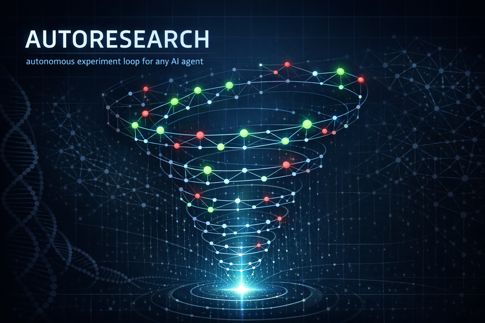

<p align="center">
  
</p>

<h1 align="center">autoresearch</h1>

<p align="center">
  <strong>One binary. Any agent. Any metric. Overnight results.</strong><br>
  <em>Generalizes <a href="https://github.com/karpathy/autoresearch">Karpathy's autoresearch</a> pattern to any project, any AI coding agent.</em>
</p>

<p align="center">
  <a href="#install">Install</a> &middot;
  <a href="#quick-start">Quick Start</a> &middot;
  <a href="#commands">Commands</a> &middot;
  <a href="#how-it-works">How It Works</a> &middot;
  <a href="#agent-integration">Agent Integration</a>
</p>

---

A single Rust binary that installs the autoresearch experiment loop into any AI coding agent, scaffolds your project, and tracks every experiment from the terminal. Designed from day one for LLM agents — structured JSON output, semantic exit codes, machine-readable capabilities, and auto-JSON when piped.

Works with [Claude Code](https://github.com/anthropics/claude-code), [Codex CLI](https://github.com/openai/codex), [OpenCode](https://github.com/opencode-ai/opencode), [Cursor](https://cursor.com), [Windsurf](https://windsurf.com), or any agent framework that can shell out to a command.

```bash
autoresearch install claude-code
autoresearch init --target-file train.py --eval-command "python train.py" --metric-name val_bpb
# Tell your agent: /autoresearch
# Go to sleep. Wake up to results.
```

---

## Why

Karpathy's autoresearch ran 126 ML experiments overnight on a single GPU. People have since applied the same pattern to [chess engines](https://x.com/MindCanvasx/status/2035817965614940472) (expert → grandmaster), [Bitcoin modeling](https://x.com/xmal/status/2035735100516634805) (halved prediction errors), [Sudoku solvers](https://x.com/VihariKanukollu/status/2035411680050778435) (beat the paper in 5 minutes), and [running 400B models on laptops](https://x.com/DAIEvolutionHub/status/2034899294709588419).

The pattern is simple: **one file to modify, one metric to optimize, one loop that never stops**.

But every project reimplements this from scratch — copying `program.md`, figuring out the eval, hand-writing JSONL logs. **autoresearch** makes it a `cargo install` away.

## Install

**One-liner (macOS / Linux):**
```bash
curl -LsSf https://github.com/199-biotechnologies/autoresearch-cli/releases/latest/download/autoresearch-installer.sh | sh
```

**Homebrew:**
```bash
brew tap 199-biotechnologies/tap
brew install autoresearch
```

**Cargo (from [crates.io](https://crates.io/crates/autoresearch)):**
```bash
cargo install autoresearch
```

**Binary size:** ~1.1MB. **Startup:** ~2ms. **Memory:** ~3MB. No Python, no Node, no Docker.

## Quick Start

### 1. Install the skill into your agent

```bash
autoresearch install all           # Claude Code + Codex + OpenCode + Cursor + Windsurf
```

This writes the autoresearch loop instructions in each agent's native format — SKILL.md for Claude/Codex/OpenCode, `.mdc` for Cursor, frontmattered `.md` for Windsurf.

### 2. Initialize your project

```bash
cd your-project
autoresearch init \
  --target-file train.py \
  --eval-command "python train.py" \
  --metric-name val_bpb \
  --metric-direction lower \
  --time-budget 5m
```

Or run `autoresearch init` without flags for interactive setup.

This creates:
- **`autoresearch.toml`** — experiment configuration
- **`program.md`** — research direction and ideas (edit this!)
- **`.autoresearch/`** — experiment logs

### 3. Pre-flight check

```bash
autoresearch doctor
```

Runs 14 checks: git repo, config valid, target file exists, eval command runs, metric parseable, branch state, stale locks, program.md, working tree clean.

### 4. Start the loop

In your agent:
```
/autoresearch
```

The agent reads your config, creates a git branch, runs the baseline, and starts iterating. Each experiment: modify the file → eval → keep or revert → record → repeat. Forever.

### 5. Wake up to results

```bash
autoresearch status              # Quick overview
autoresearch log                 # Full experiment history
autoresearch best                # Best result + diff from baseline
autoresearch report              # Full markdown research report
autoresearch diff 12 45          # Compare any two experiments
autoresearch export --format csv # Export for analysis
```

---

## Commands

| Command | Description | Agent-facing |
|---------|-------------|:---:|
| `install <target>` | Install skill into an AI agent | |
| `init` | Scaffold project (`autoresearch.toml` + `program.md`) | |
| `doctor` | 14-point pre-flight check before starting a loop | * |
| `record` | Record experiment result (handles JSONL, run numbering, deltas) | * |
| `log` | Show experiment history with metrics and status | * |
| `best` | Show best experiment + diff from baseline | * |
| `diff <a> <b>` | Compare two experiments side-by-side | * |
| `status` | Project state, best metric, loop status | * |
| `export` | Export as CSV, JSON, or JSONL | |
| `fork <names...>` | Branch experiments into parallel directions for multi-agent exploration | |
| `review` | Generate cross-model review prompt with pattern detection | * |
| `watch` | Live terminal dashboard — watch experiments in real time | |
| `merge-best` | Compare fork branches and identify the winner | * |
| `report` | Generate markdown research report | |
| `agent-info` | Machine-readable capability metadata | * |

All commands support `--json` for structured output. Auto-enabled when piped.

**Agent-facing commands** (`*`) are designed for LLMs to call directly. They return consistent JSON envelopes with semantic exit codes (0=success, 1=runtime error, 2=config error) and actionable `suggestion` fields on errors.

---

## How It Works

```
You write program.md          The agent runs the loop
     ┌──────────┐          ┌──────────────────────┐
     │  Ideas   │          │  1. Read program.md   │
     │  Papers  │ ───────► │  2. Modify target     │
     │  Goals   │          │  3. Commit            │
     └──────────┘          │  4. Eval (timeout)    │
                           │  5. Keep or revert    │
autoresearch.toml           │  6. autoresearch      │
     ┌──────────┐          │     record --metric   │
     │ target   │ ───────► │  7. Repeat forever    │
     │ eval_cmd │          └──────────────────────┘
     │ metric   │                    │
     └──────────┘                    ▼
                           .autoresearch/
                           experiments.jsonl
                           ┌─────────────────────┐
                           │ run 0: 1.050 baseline│
                           │ run 1: 1.042 kept    │
                           │ run 2: 1.055 discard │
                           │ run 3: 1.031 kept    │
                           └─────────────────────┘
```

The CLI handles **everything except the loop itself**:
- **Scaffolding** — `init` creates the config and research prompt
- **Validation** — `doctor` checks everything before you start
- **State management** — `record` handles JSONL atomically (agents never hand-write JSON)
- **Tracking** — `log`, `best`, `diff`, `status` parse experiments from git + JSONL
- **Reporting** — `report` generates a shareable markdown summary

The agent handles the **creative work** — deciding what to try, implementing changes, interpreting results.

---

## Agent Integration

### Supported Agents

| Agent | Format | Install path | Slash command |
|-------|--------|-------------|:---:|
| Claude Code | SKILL.md | `~/.claude/skills/autoresearch/` | `/autoresearch` |
| Codex CLI | SKILL.md | `~/.codex/skills/autoresearch/` | `/autoresearch` |
| OpenCode | SKILL.md | `~/.config/opencode/skills/autoresearch/` | `/autoresearch` |
| Cursor | .mdc rule | `.cursor/rules/autoresearch.mdc` | auto-triggered |
| Windsurf | .md rule | `.windsurf/rules/autoresearch.md` | auto-triggered |

### For Agent Developers

Every command supports `--json` and auto-detects piped output:

```bash
# Machine-readable capabilities
autoresearch agent-info --json

# Record experiment (agent calls this, never writes JSONL directly)
autoresearch record --metric 1.042 --status kept --summary "Tuned learning rate"

# Check state before next iteration
autoresearch status --json
```

Exit codes are semantic:
- `0` — success
- `1` — runtime error (retry might help)
- `2` — config/usage error (fix config, don't retry)

Error JSON includes machine-readable codes and recovery suggestions:
```json
{
  "status": "error",
  "error": {
    "code": "no_experiments",
    "message": "No experiments found on branch 'autoresearch'.",
    "suggestion": "Run `autoresearch init` then start the autoresearch loop in your agent."
  }
}
```

---

## Configuration

`autoresearch.toml`:
```toml
target_file = "train.py"           # The single file the agent may modify
eval_command = "python train.py"   # Must print the metric to stdout
metric_name = "val_bpb"            # What the metric is called
metric_direction = "lower"         # "lower" or "higher"
time_budget = "5m"                 # Max time per experiment
branch = "autoresearch"            # Git branch for experiments
```

`program.md` is free-form — tell the agent what to explore, link papers, set constraints. The agent reads it between experiments for inspiration.

---

## Multi-Direction Exploration

### Fork: Parallel Branches

When you want to explore multiple directions simultaneously:

```bash
autoresearch fork try-transformers try-convolutions try-linear
```

Creates `autoresearch-fork-try-transformers`, `autoresearch-fork-try-convolutions`, etc. from the current best. Start a separate agent on each:

```bash
git checkout autoresearch-fork-try-transformers && /autoresearch
```

### Review: Cross-Model Second Opinions

After running experiments, get a second model to review your progress:

```bash
autoresearch review --json | jq -r '.data.review_prompt'
```

Generates a structured review prompt with:
- Session summary (kept/discarded rates, baseline vs best)
- Pattern detection (stuck detection, repeated failure themes)
- Specific questions for the reviewer to answer
- Suggested next directions

Pipe to Codex or Gemini for cross-model insights that break local minima.

### Watch: Live Dashboard

Monitor experiments in real time from another terminal:

```bash
autoresearch watch
```

Shows a live-updating dashboard with sparkline progress, kept/discarded rates, best metric, and new experiment notifications. Refreshes every 2 seconds (configurable with `-i`).

### Merge Best: Pick the Winner

After forks finish exploring, compare them and find the winner:

```bash
autoresearch merge-best
```

Ranks all fork branches by best metric, shows a comparison table, and gives you the git commands to merge the winner and clean up losers.

---

## What People Are Building

The autoresearch pattern works on **anything with a measurable metric**:

| Domain | Metric | Result |
|--------|--------|--------|
| ML training | val_bpb | 126 experiments overnight, 11% improvement |
| Chess engine | Elo rating | Expert → Grandmaster (2718 Elo) |
| Bitcoin modeling | Prediction error | Halved error in one morning |
| Sudoku solver | Accuracy | Beat published paper (87% → 92.2%) |
| API latency | p99 ms | 37% reduction via KD-tree optimization |
| Trading bots | Score | 43,000% improvement via evolutionary loop |

---

## Inspired By

- [Karpathy's autoresearch](https://github.com/karpathy/autoresearch) — the original pattern (42K stars)
- [uditgoenka/autoresearch](https://github.com/uditgoenka/autoresearch) — generalized Claude Code skill (608 stars)
- [ARIS](https://github.com/wanshuiyin/Auto-claude-code-research-in-sleep) — cross-model research pipeline
- [ResearcherSkill](https://github.com/krzysztofdudek/ResearcherSkill) — domain-agnostic research agent
- [SkyPilot scaling](https://blog.skypilot.co/scaling-autoresearch/) — multi-GPU parallel autoresearch

## License

MIT — [199 Biotechnologies](https://github.com/199-biotechnologies)
